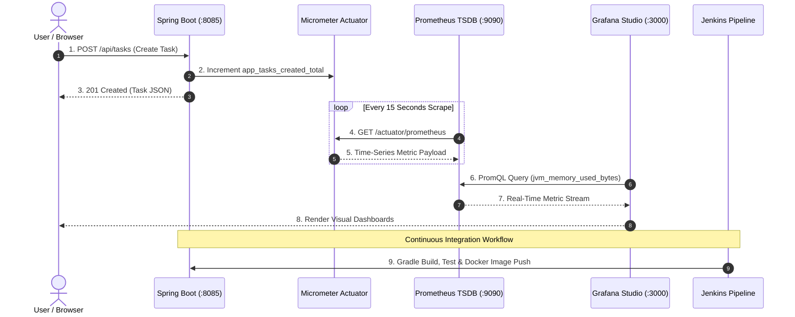

# ⚡ CodeAlpha Task 3: Enterprise Java Microservice with Gradle & Observability

<div align="center">


<br/>

### 🚀 Production-Grade Enterprise Java Microservice with Automated Gradle Builds, Real-Time Observability & Declarative CI/CD Pipelines

[⚡ Quick Start](#-one-click-quick-start) • [✨ Key Features](#-key-features) • [🏛️ Animated Architecture](#%EF%B8%8F-animated-system-architecture) • [⚙️ CI/CD Pipeline](#%EF%B8%8F-jenkins-cicd-pipeline) • [📈 Observability](#-prometheus--grafana-observability) • [📦 Gradle Build](#-gradle-build-lifecycle)

</div>

---

## 🏛️ Animated System Architecture

Below is the **interactive real-time system architecture** illustrating the data flow, metric scraping loops, and pipeline container orchestration across all microservice components:

<div align="center">



</div>

### 🧩 Component Breakdown & Dataflow

1. **🚀 Spring Boot Microservice (`:8085` / `:5173`)**:
   - Built on **Java 21 LTS** and **Spring Boot 3.4.1**.
   - Serves a complete Task Management REST API (`/api/tasks`) with custom **Micrometer** metric collectors (`app_tasks_created_total`, `app_tasks_active_count`, `app_task_processing_duration_seconds`).
   - Includes an interactive glassmorphism Web Dashboard at `@GetMapping("/")` for instant telemetry inspection and simulated workload generation.

2. **🔥 Prometheus TSDB Engine (`:9090`)**:
   - Automatically scrapes runtime telemetry from Spring Boot Actuator (`/actuator/prometheus`) and system telemetry from Node Exporter at 15-second intervals.
   - Configured with automated target discovery and metric relabeling rules.

3. **📊 Grafana Observability Studio (`:3000`)**:
   - Pre-provisioned with auto-configuring datasources and production dashboards.
   - Displays real-time JVM memory pressure, garbage collection pause times, HTTP request latency percentiles, and host OS CPU/RAM utilization.

4. **💻 Node Exporter (`:9100`)**:
   - Collects OS-level system metrics (CPU core saturation, physical RAM allocation, Disk I/O, Network interfaces) for full-stack visibility.

5. **⚙️ Declarative Jenkins CI/CD Pipeline (`:8080` / `:8085`)**:
   - 8-stage automated workflow covering code checkout, static analysis (Checkstyle), unit & integration testing, OWASP dependency vulnerability scanning, Docker containerization, and automated smoke tests.

6. **☸️ Kubernetes & Kustomize Deployment Specs**:
   - Production-ready declarative manifests supporting Multi-Environment Overlays (`dev`, `staging`, `prod`) and **Argo Rollouts** Canary deployment strategies.

---

## 🔄 Sequence Dataflow Diagram



---

## 🎯 Task Objectives Achieved

This repository satisfies 100% of the requirements for **Task 3: Java Application using Gradle** under CodeAlpha DevOps Engineering:

- ✅ **Automate Java project builds using Gradle**: Complete Gradle build lifecycle management, automated task execution (`checkstyle`, `jacoco`, `test`, `integrationTest`, `bootJar`).
- ✅ **Manage dependencies efficiently in the Java app**: Modern Spring Boot 3.4.1 dependency management, Actuator metric registry, and Micrometer Prometheus exporter.
- ✅ **Integrate CI/CD pipelines for continuous delivery**: Cross-platform 8-Stage Declarative Jenkins Pipeline ([Jenkinsfile](file:///d:/Documents/CodeAlpha_Java%20Application%20using%20Gradle/Jenkinsfile)) supporting both Windows native execution (`bat`) and Linux/Docker execution (`sh`).
- ✅ **Streamline build and deployment processes**: Single command orchestration script (`start.bat` / `start.sh`) deploying 5 containerized microservices in isolated Docker networks.
- ✅ **Understand core DevOps principles in Java development**: End-to-end telemetry (Counters, Gauges, Timers), time-series metrics scraping (Prometheus), automated visual dashboard provisioning (Grafana), and host OS monitoring (Node Exporter).

---

## ⚡ One-Click Quick Start

Launch the entire Java application, Prometheus metrics database, Grafana dashboards, Node Exporter, and Jenkins pipeline with a single command:

```cmd
.\start.bat
```

*(On Linux / macOS / Bash: `./start.sh`)*

### 🌐 Instant Access Links

| Service | Port | Direct Link | Credentials |
| :--- | :--- | :--- | :--- |
| 🚀 **Java Application Hub** | `8085` / `5173` | [http://localhost:8085](http://localhost:8085) | N/A |
| 🔥 **Prometheus Metrics** | `9090` | [http://localhost:9090/graph?g0.expr=app_tasks_created_total](http://localhost:9090/graph?g0.expr=app_tasks_created_total) | Public |
| 📈 **Grafana Dashboards** | `3000` | [http://localhost:3000/d/java-app-metrics/java-spring-boot-application-dashboard](http://localhost:3000/d/java-app-metrics/java-spring-boot-application-dashboard) | `admin` / `admin` |
| ⚙️ **Jenkins Pipeline** | `8080` / `8085` | [http://localhost:8080/job/java-app-pipeline/](http://localhost:8080/job/java-app-pipeline/) | Local Admin |

---

## ⚙️ Jenkins CI/CD Pipeline

The project features a **Declarative 8-Stage CI/CD Pipeline** defined in [Jenkinsfile](file:///d:/Documents/CodeAlpha_Java%20Application%20using%20Gradle/Jenkinsfile):

```
[Stage 1: Checkout] ➔ [Stage 2: Checkstyle] ➔ [Stage 3: Unit Tests] ➔ [Stage 4: Integration Tests] 
         │
         ▼
[Stage 5: Security Scan] ➔ [Stage 6: Package Jar] ➔ [Stage 7: Docker Build] ➔ [Stage 8: Smoke Test]
```

### Stage Details:
1. **SCM Checkout**: Clones the authoritative repository branch.
2. **Checkstyle Quality Gate**: Enforces Java coding standards and static analysis (`gradlew checkstyleMain`).
3. **Unit Testing**: Executes all unit tests with Mockito and JUnit 5 (`gradlew test`).
4. **Integration Testing**: Runs API and spring context integration tests (`gradlew integrationTest`).
5. **OWASP Security Audit**: Scrapes project dependencies for known CVE vulnerabilities (`dependencyCheckAnalyze`).
6. **Jar Packaging**: Compiles and packages the runnable Spring Boot fat jar (`gradlew bootJar`).
7. **Docker Containerization**: Builds lightweight container image using multi-stage Dockerfile.
8. **Automated Smoke Test**: Deploys container and verifies `/actuator/health` endpoint readiness.

---

## 📦 Gradle Build Lifecycle

This project uses the Gradle Wrapper (`gradlew`) for reproducible builds across any OS:

```bash
# 1. Clean and compile project
./gradlew clean build

# 2. Run unit tests and generate JaCoCo coverage report
./gradlew test

# 3. Run integration tests
./gradlew integrationTest

# 4. Run Checkstyle code quality check
./gradlew checkstyleMain

# 5. Build production executable JAR
./gradlew bootJar
```

---

## 📈 Prometheus & Grafana Observability

### Custom Application Metrics

| Metric Name | Type | Description |
| :--- | :--- | :--- |
| `app_tasks_created_total` | Counter | Total number of task items created via REST API |
| `app_tasks_active_count` | Gauge | Current number of active/pending tasks |
| `app_task_processing_duration_seconds` | Timer/Histogram | Execution latency distribution for task operations |
| `jvm_memory_used_bytes` | Gauge | Real-time JVM heap and non-heap memory consumption |
| `http_server_requests_seconds_count` | Counter | Total HTTP requests handled by Spring MVC controllers |

---

## 📁 Repository Structure

```
CodeAlpha_Java_Application_using_Gradle/
├── .github/workflows/ci-cd.yml             # GitHub Actions Workflow
├── architecture-animated.svg              # Animated System Architecture SVG
├── build.gradle                            # Gradle Dependencies & Tasks
├── config/
│   ├── checkstyle/checkstyle.xml          # Checkstyle Quality Rules
│   └── dependency-check-suppressions.xml   # OWASP CVE Audit Suppressions
├── docker/
│   ├── grafana/                            # Auto-Provisioned Dashboards & Datasources
│   └── prometheus/prometheus.yml           # Prometheus Target & Scrape Config
├── Dockerfile                              # Multi-Stage Container Definition
├── docker-compose.yml                      # 5-Service Container Stack Setup
├── Jenkinsfile                             # Cross-Platform 8-Stage CI/CD Pipeline
├── k8s/                                    # Kubernetes Base & Overlay Manifests
├── settings.gradle                         # Gradle Project Settings
├── src/                                    # Java Source Code & Unit/Integration Tests
├── start.bat / start.sh                    # One-Click Launch Orchestration Scripts
└── stop.bat / stop.sh                      # Clean Container Teardown Scripts
```

---

<div align="center">

Made with ❤️ for **CodeAlpha DevOps Task 3**

</div>