<div align="center">
  
  <h1>CodeAlpha Internship - Task 2</h1>
  <h2>🚀 Advanced Enterprise Jenkins Remoting &amp; Distributed Pipeline</h2>

  <p align="center">
    
    
    
    
    
    
  </p>
  
  <p><em>Enterprise-grade distributed build automation, cross-platform remoting (Windows JNLP &amp; Linux SSH), JCasC IaC, visual pipeline graphs, dynamic parallel matrix testing, and security gates.</em></p>
</div>

---

## 🎨 Animated Architecture Diagram

Below is the dynamic, animated architectural design of this distributed remoting ecosystem:



---

## 🎯 Executive Project Overview

This repository houses an enterprise-ready **Distributed CI/CD Remoting Pipeline Architecture** built as **Task 2** for the **CodeAlpha Internship**. 

Modern DevOps infrastructure requires scalable, resilient, cross-platform build environments where different stages execute on tailored OS operating systems (e.g., Windows compilation, Linux packaging & security auditing). This project implements an automated, zero-touch Jenkins setup configured via **Jenkins Configuration as Code (JCasC)** and **Docker Compose**.

### Key Architectural Highlights:
- 🌐 **Cross-Platform Payload Transfer (`stash` / `unstash`)**: Seamlessly compiles core binaries on isolated **Windows JNLP nodes**, stashes them securely in memory at the Jenkins Controller, and unstashes them onto **Linux SSH nodes** for wrapper attachment and MD5 checksum verification.
- ⚙️ **Zero-Touch Infrastructure-as-Code (JCasC)**: Pre-configures Jenkins security, global credentials, SSH agent nodes, JNLP agent nodes, Job DSL definitions, and custom dashboard views automatically upon startup (`casc.yaml`).
- 🔀 **Dynamic Groovy Parallel Test Matrix**: Programmatically generates and executes parallel test suites (Security Audit, Integration Suite, Performance Load Test, Regression Suite) using Groovy closures.
- 📊 **Visual Pipeline Dashboard & Stage Graph View**: Pre-loaded with `pipeline-stage-view` and `pipeline-graph-view` plugins for real-time visualization of stage progress and node allocation.
- 🔒 **Security Audit Gate & Fingerprinting**: Embedded SAST security checks, automated MD5 checksum generation, and Jenkins artifact fingerprinting for end-to-end auditability.

---

## 🔄 Interactive Sequence & Execution Flowchart

```mermaid
sequenceDiagram
    autonumber
    actor Developer as 👤 DevOps Engineer
    participant Controller as 🚀 Jenkins Controller (Docker :8080)
    participant WinAgent as 💻 Windows Agent (JNLP)
    participant LinAgent as 🐧 Linux Agent (SSH)

    Developer->>Controller: Trigger Pipeline (DEV / STAGING / PROD)
    
    par Cross-Node Initialization
        Controller->>WinAgent: Provision & Wipe Workspace
        Controller->>LinAgent: Execute nodeHealth.sh System Audit
    end

    rect rgb(25, 35, 60)
        note right of WinAgent: Distributed Build & Data Transfer
        Controller->>WinAgent: Compile Core Payload (windows_core.dat)
        WinAgent->>Controller: stash 'windows_payload' to Controller Memory
        Controller->>LinAgent: unstash 'windows_payload' onto Linux Node
        LinAgent->>LinAgent: Append Linux Wrapper & Compute checksum.md5
        LinAgent->>Controller: Archive Artifacts & Register Fingerprint
    end

    rect rgb(20, 50, 40)
        note over Controller, LinAgent: Security Audit & Dynamic Testing
        Controller->>LinAgent: Run Security Vulnerability Scan (SAST Gate)
        Controller->>Controller: Generate Dynamic Groovy Parallel Test Matrix
        par Parallel Test Execution
            Controller->>LinAgent: 🛡️ Security Audit Suite
            Controller->>LinAgent: 🔗 Integration Contract Test
            Controller->>WinAgent: ⚡ Performance Load Test
            Controller->>LinAgent: 🧪 Multi-Node Regression Suite
        end
    end

    rect rgb(60, 40, 20)
        note over Controller: Deployment & Teardown
        Controller->>LinAgent: Deploy Release to Target Environment
        Controller->>Developer: Notify Build Success & Emit Visual Pipeline Dashboard
    end
```



---

## 🛠️ Infrastructure Components & Features

### 1. ⚙️ Jenkins Configuration as Code (`casc.yaml`)
Eliminates manual Jenkins setup. Upon starting the Jenkins Docker container, JCasC automatically provisions:
- **Security Realm & Matrix Authorization**: Configures `admin` authentication and global permission matrices.
- **Node Definitions**: 
  - `linux-agent`: Permanent SSH agent connected via port 22 with pre-injected ED25519 SSH keys.
  - `windows-agent`: Permanent JNLP agent configured for inbound TCP remoting.
- **Job DSL Integration**: Automatically creates two ready-to-run pipelines:
  - `⚡ Enterprise Advanced CI/CD Pipeline` (`Jenkinsfile`)
  - `🌐 Distributed Cross-Node Remoting Demo` (`jenkinsfile`)
- **Pipeline-Dashboard**: Custom dashboard view featuring weather status, build duration, and job triggers.

### 2. 🔀 Distributed Pipeline Logic (`Jenkinsfile` / `jenkinsfile`)
Written using Declarative Pipeline syntax with embedded Groovy scripting:
- **Options**: Automated log rotation (`numToKeepStr: '10'`), build timeouts (30 mins), and concurrent build guards.
- **Dynamic Parameters**: Environment choices (`DEV`, `STAGING`, `PROD`) and boolean toggles (`RUN_FULL_SUITE`).
- **Resilient Label Selectors**: Uses fallback label selectors (`windows || linux || built-in`) to guarantee pipeline completion even during single-node maintenance.

### 3. 💻 Windows JNLP Agent Connector (`connect-windows-agent.ps1`)
An automated PowerShell script designed to run on Windows nodes:
- Polls the Jenkins Controller until HTTP endpoint `/login` is ready.
- Downloads `agent.jar` dynamically from the controller.
- Authenticates using REST API headers to extract the unique JNLP secret token from XML endpoint `/computer/windows-agent/jenkins-agent.jnlp`.
- Spawns the Java remoting process with working directory `C:\JenkinsAgent`.

### 4. 🐧 Linux Agent Health Checker (`nodeHealth.sh`)
A Bash diagnostic utility executed during pipeline initialization:
- Audits disk utilization (`df -h /`).
- Monitors available RAM memory (`free -m`).
- Checks node uptime and system load (`uptime`).
- Verifies workspace permissions and active user environment.

---

## 📂 Repository File Structure

| File | Type | Description |
| :--- | :--- | :--- |
| [`Jenkinsfile`](jenkinsfile) | Pipeline Script | Multi-stage declarative pipeline featuring remoting, stashing, dynamic parallel testing matrix, security gates, and MD5 fingerprinting. |
| [`casc.yaml`](casc.yaml) | JCasC Config | Infrastructure-as-Code file auto-configuring Jenkins security, SSH/JNLP agents, plugins, Job DSL pipelines, and dashboards. |
| [`docker-compose.yml`](docker-compose.yml) | IaC Compose | Spins up `jenkins-controller` (port 8080/50000) and `jenkins-linux-agent` (SSH) in an isolated bridge network. |
| [`Dockerfile`](Dockerfile) | Container Build | Builds custom Jenkins image pre-baked with plugins listed in `plugins.txt` and JCasC configuration. |
| [`connect-windows-agent.ps1`](connect-windows-agent.ps1) | PowerShell | Automated agent connector script for attaching Windows remote nodes via JNLP remoting. |
| [`nodeHealth.sh`](nodeHealth.sh) | Shell Script | Health auditing script for Linux SSH agent nodes. |
| [`plugins.txt`](plugins.txt) | Dependency List | List of required Jenkins plugins (JCasC, Job DSL, Pipeline Stage View, Pipeline Graph View, SSH Slaves, Matrix Auth). |
| [`architecture.svg`](architecture.svg) | Graphic | Vector SVG animation diagram detailing system nodes, payload flows, and testing matrices. |

---

## 🚀 Quick Start & Installation Guide

### Prerequisites
Ensure the following tools are installed on your workstation:
- [Docker & Docker Compose](https://www.docker.com/)
- [PowerShell 5.1+](https://learn.microsoft.com/en-us/powershell/) (for Windows remote agent)
- [Java JDK 17+](https://adoptium.net/) (if running Windows agent locally)

---

### Step 1: Spin Up Infrastructure via Docker Compose
From the project root directory, run:
```bash
docker-compose up -d --build
```
This launches:
1. **`jenkins-controller`** at **`http://localhost:8080`** (JNLP port: `50000`).
2. **`jenkins-linux-agent`** SSH container with pre-configured credentials.

---

### Step 2: Connect Windows Remote Agent (Optional)
To attach a physical or virtual Windows machine as a remoting node:
1. Open PowerShell as Administrator.
2. Execute the automated agent launcher script:
```powershell
.\connect-windows-agent.ps1
```
The script will wait for Jenkins Controller readiness, download `agent.jar`, retrieve the secret key, and establish the JNLP connection to `C:\JenkinsAgent`.

---

### Step 3: Access Jenkins Dashboard & Trigger Pipelines
1. Navigate to **`http://localhost:8080`** in your browser.
2. Log in with default admin credentials:
   - **Username**: `admin`
   - **Password**: `admin`
3. Open the **`Pipeline-Dashboard`** view.
4. Select **`⚡ Enterprise Advanced CI/CD Pipeline`** or **`🌐 Distributed Cross-Node Remoting Demo`**.
5. Click **Build with Parameters** -> Select Target Environment (`DEV`, `STAGING`, `PROD`) -> Click **Build**.
6. View real-time visual progress on the **Stage View** and **Pipeline Graph View** dashboards!

---

## 📊 Pipeline Stage Execution Breakdown

```
[ Cross-Node Initialization ]  ──►  [ Distributed Build & Data Transfer ]  ──►  [ Run Security Tests ]
   ├─ Init Linux (SSH)                 ├─ Compile Core (Windows)                   └─ SAST Audit Gate
   └─ Init Windows (JNLP)              └─ Assemble & Package (Linux)
                                                  │
                                                  ▼
[ Final Deployment ]  ◄──  [ Dynamic Parallel Testing Matrix ]
   └─ Deploy to Target        ├─ Security Audit Suite
                              ├─ Integration Contract Suite
                              ├─ Performance Load Suite
                              └─ Regression Test Suite
```

1. **Cross-Node Initialization**:
   Executes parallel initialization tasks on Windows and Linux nodes, validating workspace cleanliness and executing `nodeHealth.sh`.
2. **Distributed Build & Data Transfer**:
   - **Windows Node**: Compiles `windows_core.dat` core binary payload and executes `stash name: 'windows_payload'`.
   - **Linux Node**: Executes `unstash 'windows_payload'`, appends Linux wrapper logic, creates `final_release_package.txt`, generates `checksum.md5`, and archives artifacts with fingerprinting.
3. **Run Security Tests**:
   Executes static code analysis and dependency vulnerability auditing.
4. **Dynamic Parallel Testing Matrix**:
   Uses Groovy map closures to programmatically fire 4 parallel test suites simultaneously.
5. **Final Deployment**:
   Promotes build artifacts to the designated target environment (`DEV` / `STAGING` / `PROD`).

---

## 🎓 Internship Task Context

This project was developed for **CodeAlpha Internship - Task 2**:
- **Domain**: Cloud & DevOps Engineering / CI/CD Automation
- **Focus**: Jenkins Remoting, Distributed Architectures, Infrastructure-as-Code, and Visual Pipeline Engineering.
- **Repository**: [CodeAlpha Tasks](https://github.com/jishnuvardhankancharla2005/CodeAlpha-Tasks) / [Jenkins Remoting Project](https://github.com/jishnuvardhankancharla2005/CodeAlpha_Jenkins-Remoting-Project)

---

## 📄 License & Credits

Developed with ❤️ by **Jishnu Vardhan Kancharla** for the **CodeAlpha Internship Program**.

Licensed under the [MIT License](LICENSE).
=======
## 👋 About This Repository

This repository consolidates my **CodeAlpha DevOps & Cloud Engineering Internship** deliverables into one submission. Rather than three disconnected exercises, I designed them to interlock as a single pipeline narrative: a change is picked up by a **distributed Jenkins remoting setup**, built and validated by a **Gradle-automated Java service with full observability**, and the result is shipped to a **self-healing, load-balanced Docker infrastructure**. That flow is what the animated diagram below represents.

Each task lives in its own dedicated repository, linked below, with full setup instructions, architecture notes, and demo scripts. This page exists to give a reviewer the complete picture in one pass — what was built, why it was built that way, and what it demonstrates.

---

## 🗺️ Architecture Overview

<div align="center">

</div>

<p align="center"><i>The unified pipeline view above. Each task also has its own detailed, animated architecture diagram in its section below.</i></p>

---

## 📁 Project Repositories

| Task | Repository |
| :--- | :--- |
| ⚙️ Task 2 — Jenkins Remoting | [CodeAlpha_Jenkins-Remoting-Project](https://github.com/jishnuvardhankancharla2005/CodeAlpha_Jenkins-Remoting-Project) |
| ☕ Task 3 — Java Application using Gradle | [CodeAlpha_java_application_by_gradle](https://github.com/jishnuvardhankancharla2005/CodeAlpha_java_application_by_gradle) |
| 🐳 Task 4 — Web Server using Docker | [CodeAlpha_Web_Server_Using_Docker](https://github.com/jishnuvardhankancharla2005/CodeAlpha_Web_Server_Using_Docker) |

---

## 🧭 Table of Contents

- [Task 2 — Jenkins Remoting](#-task-2--jenkins-remoting)
- [Task 3 — Java Application using Gradle](#-task-3--java-application-using-gradle)
- [Task 4 — Web Server using Docker](#-task-4--web-server-using-docker)
- [Skills Demonstrated](#-skills-demonstrated-across-all-three-tasks)
- [How Everything Connects](#-how-the-three-projects-connect)
- [Running Each Project](#-running-each-project)
- [About Me](#-about-me)

---

## ⚙️ Task 2 — Jenkins Remoting

**Goal:** Set up distributed Jenkins nodes to run builds securely across architectures, with node-level isolation as a first-class security concern rather than an afterthought.

**What's inside:**
- A Jenkins Controller with **Windows JNLP** and **Linux SSH** remote agents, provisioned declaratively via **Jenkins Configuration as Code (`casc.yaml`)** instead of manual UI clicking.
- A pipeline that **compiles on Windows, stashes the payload to the controller, and unstashes it onto Linux** for patching and final assembly — a genuine cross-architecture remoting pattern, not just "two agents that exist."
- A **dynamic Groovy-generated parallel test matrix** (security, integration, performance, contract testing) instead of hardcoded stages.
- **Node isolation controls**: zero executors on the controller, least-privilege agent service accounts, containerized agent sandboxing on an isolated network, and per-node scoped credentials — so a compromised agent can't reach the controller's trust boundary.
- **Milestone-gated production promotion** with manual approval and automatic abortion of stale builds.

**Why it matters:** This goes beyond "connect two agents" — it demonstrates understanding of *why* remoting exists (workload distribution, architecture coverage) and *how* to keep it secure (isolation, least privilege, scoped trust), which is the part most junior setups skip.

<div align="center">

</div>

📂 **[Full README →](https://github.com/jishnuvardhankancharla2005/CodeAlpha_Jenkins-Remoting-Project#readme)**

---

## ☕ Task 3 — Java Application using Gradle

**Goal:** Automate a Java application's build lifecycle end-to-end and integrate it into a CI/CD pipeline — not just "run gradle build" but a service that's actually observable and deployable.

**What's inside:**
- A **Spring Boot 3.4.1 REST microservice** with full CRUD endpoints, built and validated by an automated **Gradle 8.13 lifecycle**: `checkstyle` → `test` → `integrationTest` → `jacoco` → `bootJar`.
- An **8-stage declarative Jenkins pipeline** (checkout → lint → unit tests → integration tests → security scan → package → Docker build → smoke test) that auto-detects OS and runs `sh` or `gradlew.bat` accordingly.
- **Custom application telemetry** via Micrometer (counters, gauges, timers) scraped by **Prometheus** and visualized in auto-provisioned **Grafana dashboards** — plus host-level metrics via Node Exporter.
- A **one-command orchestration script** (`start.sh` / `start.bat`) that stands up the entire 5-container stack (app, Prometheus, Grafana, Node Exporter, Jenkins) in one shot.

**Why it matters:** Anyone can run `gradle build`. This demonstrates that a build pipeline isn't finished until you can *see* what the application is doing in production — dependency management, testing, and delivery all in service of an observable, deployable artifact.

<div align="center">

</div>

📂 **[Full README →](https://github.com/jishnuvardhankancharla2005/CodeAlpha_java_application_by_gradle#readme)**

---

## 🐳 Task 4 — Web Server using Docker

**Goal:** Deploy and manage a web server in Docker with a real understanding of container lifecycle, health, and troubleshooting — not just `docker run nginx`.

**What's inside:**
- An **Nginx reverse proxy** load-balancing across **horizontally scalable replicas** (`least_conn` routing, scales to 5+ nodes with zero downtime).
- **Two-tier network isolation**: a `frontend-net` bridge exposed to the host, and an internal-only `backend-net` that a Redis cache sits behind — direct host access to the database is blocked by design.
- **Proactive health checks** (`HEALTHCHECK` probes every 10s) driving **auto-healing**: containers that crash are detected and restarted automatically, with Nginx routing around the failure in the meantime.
- **Enforced resource governance** — explicit CPU (0.5 core) and memory (256MB) limits per container, with reservations to prevent noisy-neighbor issues.
- A **PowerShell demo suite** that proves each of these claims live: `scale-demo.ps1`, `simulate-crash.ps1` (kills PID 1 inside a container to test failover), `test-advanced.ps1`, and `test-lifecycle.ps1`.

**Why it matters:** This treats "web server in Docker" as a systems problem — availability, isolation, and resource governance — and then proves each property with a runnable script instead of just asserting it in prose.

<div align="center">

</div>

📂 **[Full README →](https://github.com/jishnuvardhankancharla2005/CodeAlpha_Web_Server_Using_Docker#readme)**

---

## 🧩 How the Three Projects Connect

| Stage | Project | What Happens |
| :--- | :--- | :--- |
| 1️⃣ Trigger | **Jenkins Remoting** | A commit triggers a pipeline distributed across Windows/Linux remote agents, isolated from the controller |
| 2️⃣ Build & Validate | **Java + Gradle** | The Jenkins pipeline drives a Gradle build: compile, lint, unit + integration tests, package as a JAR, containerize |
| 3️⃣ Observe | **Java + Gradle** | The running service exposes metrics that Prometheus scrapes and Grafana visualizes |
| 4️⃣ Deploy | **Docker Web Server** | The built artifact is served behind a load-balanced, auto-healing, network-isolated Nginx cluster |

Each project stands on its own, but together they cover the full loop: **remote build → automated validation → observability → resilient deployment**.

---

## 🛠️ Skills Demonstrated Across All Three Tasks

| Category | Skills |
| :--- | :--- |
| **CI/CD** | Declarative Jenkins pipelines, multi-agent orchestration, Jenkins Configuration as Code (JCasC), parallel/dynamic stage generation |
| **Build Automation** | Gradle lifecycle management, dependency resolution, static analysis (Checkstyle), coverage (JaCoCo) |
| **Containerization** | Docker Compose multi-service stacks, multi-stage Dockerfiles, health checks, resource quotas |
| **Networking & Security** | Bridge network isolation, internal-only networks, least-privilege service accounts, credential scoping |
| **Observability** | Prometheus metrics, Grafana dashboard provisioning, custom application telemetry (Micrometer), host metrics |
| **Reliability Engineering** | Auto-healing, load balancing, horizontal scaling, zero-downtime failover |
| **Automation Scripting** | PowerShell/Bash test harnesses, one-command environment orchestration |

---

## ▶️ Running Each Project

Each task lives in its own repository — clone whichever one you want to run:

```bash
# Task 2 — Jenkins Remoting
git clone https://github.com/jishnuvardhankancharla2005/CodeAlpha_Jenkins-Remoting-Project.git
cd CodeAlpha_Jenkins-Remoting-Project
docker-compose up -d --build

# Task 3 — Java Application using Gradle
git clone https://github.com/jishnuvardhankancharla2005/CodeAlpha_java_application_by_gradle.git
cd CodeAlpha_java_application_by_gradle
./start.sh        # or start.bat on Windows

# Task 4 — Web Server using Docker
git clone https://github.com/jishnuvardhankancharla2005/CodeAlpha_Web_Server_Using_Docker.git
cd CodeAlpha_Web_Server_Using_Docker
docker compose up -d
```

Each repository's own README has full prerequisites, port mappings, and demo instructions.

---

## 🙋 About Me

**Jishnu Vardhan Kancharla**
DevOps & Cloud Engineering Intern @ CodeAlpha

I'm looking to bring this same approach — building things that don't just meet the requirement but prove their own reliability — to a full-time DevOps/Platform Engineering role. Happy to walk through any part of this repo in more depth.

[](https://github.com/jishnuvardhankancharla2005)
[](https://linkedin.com/in/JishnuVardhanKancharla)
[](mailto:jishnuvardhan558@gmail.com)

---

</div>
