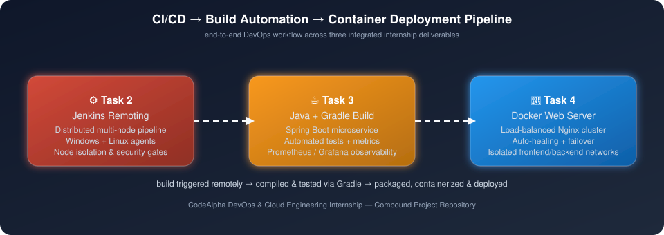
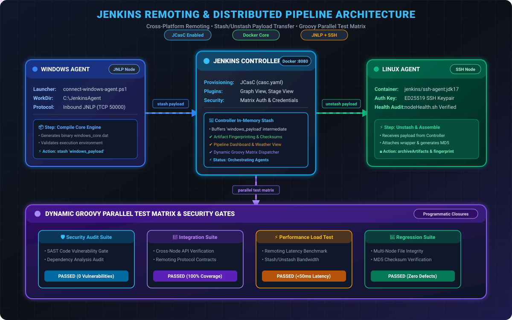
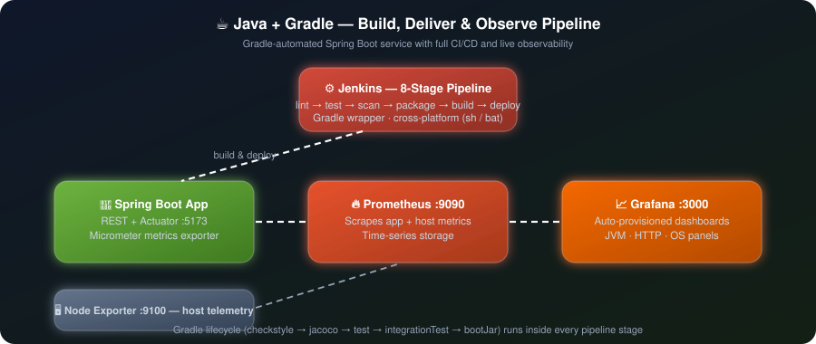
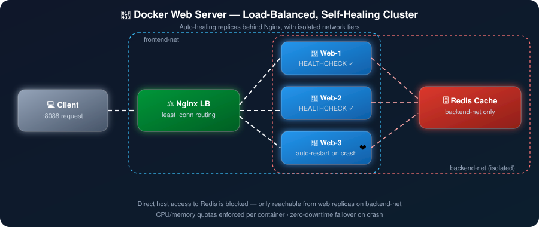

<div align="center">


<br/>


<br/><br/>

[](#-task-2--jenkins-remoting)
[](#-task-3--java-application-using-gradle)
[](#-task-3--java-application-using-gradle)
[](#-task-4--web-server-using-docker)
[](#-task-4--web-server-using-docker)
[](#-task-3--java-application-using-gradle)
[](#-task-3--java-application-using-gradle)

<p><b>Three end-to-end DevOps engineering projects — remote build orchestration, automated Java delivery, and containerized infrastructure — built as a single, coherent internship portfolio.</b></p>

</div>

---

## 👋 About This Repository

This repository consolidates my **CodeAlpha DevOps & Cloud Engineering Internship** deliverables into one submission. Rather than three disconnected exercises, I designed them to interlock as a single pipeline narrative: a change is picked up by a **distributed Jenkins remoting setup**, built and validated by a **Gradle-automated Java service with full observability**, and the result is shipped to a **self-healing, load-balanced Docker infrastructure**. That flow is what the animated diagram below represents.

Each task folder contains its own detailed README with setup instructions, architecture notes, and demo scripts. This root README exists to give a reviewer the complete picture in one pass — what was built, why it was built that way, and what it demonstrates.

> 📌 **Note:** Replace the placeholders below (`[Your Name]`, GitHub/LinkedIn links, folder paths) with your actual details before publishing.

---

## 🗺️ Architecture Overview

<div align="center">

</div>

<p align="center"><i>The unified pipeline view above. Each task also has its own detailed, animated architecture diagram in its section below.</i></p>

---

## 📁 Repository Structure

```text
.
├── task-2-jenkins-remoting/        # Distributed CI/CD orchestration across remote nodes
│   ├── Jenkinsfile
│   ├── casc.yaml
│   ├── docker-compose.yml
│   └── README.md
│
├── task-3-java-gradle/             # Spring Boot microservice, Gradle build, observability stack
│   ├── src/
│   ├── build.gradle
│   ├── Jenkinsfile
│   ├── docker-compose.yml
│   └── README.md
│
├── task-4-docker-webserver/        # Load-balanced, self-healing Nginx web cluster
│   ├── docker-compose.yml
│   ├── scripts/
│   └── README.md
│
├── assets/
│   ├── architecture-animated.svg              # combined 3-task pipeline view
│   ├── task2-jenkins-remoting-animated.svg     # Task 2 architecture
│   ├── task3-java-gradle-animated.svg          # Task 3 architecture
│   └── task4-docker-webserver-animated.svg     # Task 4 architecture
│
└── README.md                       # ← you are here
```

---

## 🧭 Table of Contents

- [Task 2 — Jenkins Remoting](#-task-2--jenkins-remoting)
- [Task 3 — Java Application using Gradle](#-task-3--java-application-using-gradle)
- [Task 4 — Web Server using Docker](#-task-4--web-server-using-docker)
- [Skills Demonstrated](#-skills-demonstrated-across-all-three-tasks)
- [How Everything Connects](#-how-the-three-projects-connect)
- [Running Each Project](#-running-each-project)
- [About Me](#-about-me)

---

## ⚙️ Task 2 — Jenkins Remoting

**Goal:** Set up distributed Jenkins nodes to run builds securely across architectures, with node-level isolation as a first-class security concern rather than an afterthought.

**What's inside:**
- A Jenkins Controller with **Windows JNLP** and **Linux SSH** remote agents, provisioned declaratively via **Jenkins Configuration as Code (`casc.yaml`)** instead of manual UI clicking.
- A pipeline that **compiles on Windows, stashes the payload to the controller, and unstashes it onto Linux** for patching and final assembly — a genuine cross-architecture remoting pattern, not just "two agents that exist."
- A **dynamic Groovy-generated parallel test matrix** (security, integration, performance, contract testing) instead of hardcoded stages.
- **Node isolation controls**: zero executors on the controller, least-privilege agent service accounts, containerized agent sandboxing on an isolated network, and per-node scoped credentials — so a compromised agent can't reach the controller's trust boundary.
- **Milestone-gated production promotion** with manual approval and automatic abortion of stale builds.

**Why it matters:** This goes beyond "connect two agents" — it demonstrates understanding of *why* remoting exists (workload distribution, architecture coverage) and *how* to keep it secure (isolation, least privilege, scoped trust), which is the part most junior setups skip.

<div align="center">

</div>

📂 [`/task-2-jenkins-remoting`](./task-2-jenkins-remoting) · [Full README](./task-2-jenkins-remoting/README.md)

---

## ☕ Task 3 — Java Application using Gradle

**Goal:** Automate a Java application's build lifecycle end-to-end and integrate it into a CI/CD pipeline — not just "run gradle build" but a service that's actually observable and deployable.

**What's inside:**
- A **Spring Boot 3.4.1 REST microservice** with full CRUD endpoints, built and validated by an automated **Gradle 8.13 lifecycle**: `checkstyle` → `test` → `integrationTest` → `jacoco` → `bootJar`.
- An **8-stage declarative Jenkins pipeline** (checkout → lint → unit tests → integration tests → security scan → package → Docker build → smoke test) that auto-detects OS and runs `sh` or `gradlew.bat` accordingly.
- **Custom application telemetry** via Micrometer (counters, gauges, timers) scraped by **Prometheus** and visualized in auto-provisioned **Grafana dashboards** — plus host-level metrics via Node Exporter.
- A **one-command orchestration script** (`start.sh` / `start.bat`) that stands up the entire 5-container stack (app, Prometheus, Grafana, Node Exporter, Jenkins) in one shot.

**Why it matters:** Anyone can run `gradle build`. This demonstrates that a build pipeline isn't finished until you can *see* what the application is doing in production — dependency management, testing, and delivery all in service of an observable, deployable artifact.

<div align="center">

</div>

📂 [`/task-3-java-gradle`](./task-3-java-gradle) · [Full README](./task-3-java-gradle/README.md)

---

## 🐳 Task 4 — Web Server using Docker

**Goal:** Deploy and manage a web server in Docker with a real understanding of container lifecycle, health, and troubleshooting — not just `docker run nginx`.

**What's inside:**
- An **Nginx reverse proxy** load-balancing across **horizontally scalable replicas** (`least_conn` routing, scales to 5+ nodes with zero downtime).
- **Two-tier network isolation**: a `frontend-net` bridge exposed to the host, and an internal-only `backend-net` that a Redis cache sits behind — direct host access to the database is blocked by design.
- **Proactive health checks** (`HEALTHCHECK` probes every 10s) driving **auto-healing**: containers that crash are detected and restarted automatically, with Nginx routing around the failure in the meantime.
- **Enforced resource governance** — explicit CPU (0.5 core) and memory (256MB) limits per container, with reservations to prevent noisy-neighbor issues.
- A **PowerShell demo suite** that proves each of these claims live: `scale-demo.ps1`, `simulate-crash.ps1` (kills PID 1 inside a container to test failover), `test-advanced.ps1`, and `test-lifecycle.ps1`.

**Why it matters:** This treats "web server in Docker" as a systems problem — availability, isolation, and resource governance — and then proves each property with a runnable script instead of just asserting it in prose.

<div align="center">

</div>

📂 [`/task-4-docker-webserver`](./task-4-docker-webserver) · [Full README](./task-4-docker-webserver/README.md)

---

## 🧩 How the Three Projects Connect

| Stage | Project | What Happens |
| :--- | :--- | :--- |
| 1️⃣ Trigger | **Jenkins Remoting** | A commit triggers a pipeline distributed across Windows/Linux remote agents, isolated from the controller |
| 2️⃣ Build & Validate | **Java + Gradle** | The Jenkins pipeline drives a Gradle build: compile, lint, unit + integration tests, package as a JAR, containerize |
| 3️⃣ Observe | **Java + Gradle** | The running service exposes metrics that Prometheus scrapes and Grafana visualizes |
| 4️⃣ Deploy | **Docker Web Server** | The built artifact is served behind a load-balanced, auto-healing, network-isolated Nginx cluster |

Each project stands on its own, but together they cover the full loop: **remote build → automated validation → observability → resilient deployment**.

---

## 🛠️ Skills Demonstrated Across All Three Tasks

| Category | Skills |
| :--- | :--- |
| **CI/CD** | Declarative Jenkins pipelines, multi-agent orchestration, Jenkins Configuration as Code (JCasC), parallel/dynamic stage generation |
| **Build Automation** | Gradle lifecycle management, dependency resolution, static analysis (Checkstyle), coverage (JaCoCo) |
| **Containerization** | Docker Compose multi-service stacks, multi-stage Dockerfiles, health checks, resource quotas |
| **Networking & Security** | Bridge network isolation, internal-only networks, least-privilege service accounts, credential scoping |
| **Observability** | Prometheus metrics, Grafana dashboard provisioning, custom application telemetry (Micrometer), host metrics |
| **Reliability Engineering** | Auto-healing, load balancing, horizontal scaling, zero-downtime failover |
| **Automation Scripting** | PowerShell/Bash test harnesses, one-command environment orchestration |

---

## ▶️ Running Each Project

```bash
# Clone the repository
git clone https://github.com/<your-username>/<your-repo-name>.git
cd <your-repo-name>

# Task 2 — Jenkins Remoting
cd task-2-jenkins-remoting && docker-compose up -d --build

# Task 3 — Java Application using Gradle
cd ../task-3-java-gradle && ./start.sh        # or start.bat on Windows

# Task 4 — Web Server using Docker
cd ../task-4-docker-webserver && docker compose up -d
```

Each subfolder's README has full prerequisites, port mappings, and demo instructions.

---

## 🙋 About Me

**Jishnu Vardhan Kancharla**
DevOps & Cloud Engineering Intern @ CodeAlpha

I'm looking to bring this same approach — building things that don't just meet the requirement but prove their own reliability — to a full-time DevOps/Platform Engineering role. Happy to walk through any part of this repo in more depth.

[](https://github.com/jishnuvardhankancharla2005)
[](https://linkedin.com/in/JishnuVardhanKancharla)
[](mailto:jishnuvardhan558@gmail.com)

---

<div align="center">

</div>
